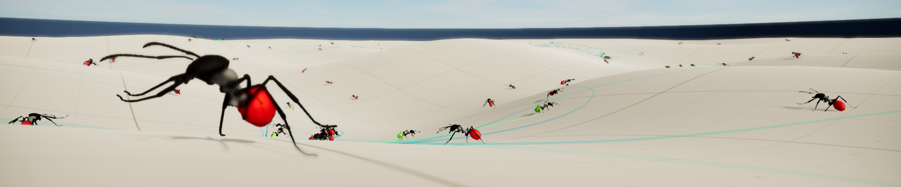

## Unity Robot Ants (Reinforcement Learning) - [Video](https://www.youtube.com/watch?v=EwB8XXCYOsc)

These robot ants want to explore the terrain but also need to find power-ups and recharge. They leave trails proportional to their energy level. Each ant scans its vicinity for trails to follow. Pathways between power-ups emerge over time.

Dependencies: [Unity ML-Agents v0.6](https://github.com/Unity-Technologies/ml-agents) and [Unity Tensorflow Plugin](https://github.com/Unity-Technologies/ml-agents/blob/master/docs/Using-TensorFlow-Sharp-in-Unity.md)

Ant Design: Ergin3D (modified) via [turbosquid](https://www.turbosquid.com/FullPreview/Index.cfm/ID/1339233)
