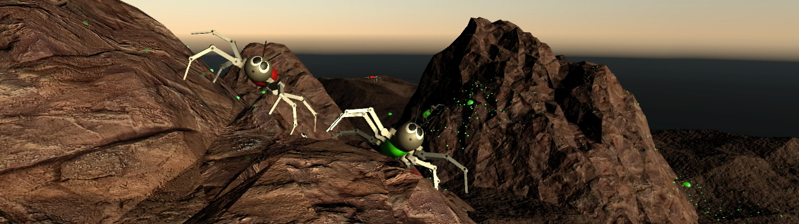

## Unity Robot Ants (Reinforcement Learning) - [Video](https://youtu.be/iUOOoM0NLlo)

These robot ants want to explore as much terrain as possible but also need to recharge regularly. In order to help its friends find nearby power-ups, every robot frequently drops little blobs of slowly dissipating radioactive material. Each blob's initial energy is proportional to the robot's battery level. The project was inspired by foraging ants that lay down pheromone trails.

The desired behavior emerges through two-level reinforcement learning. On the top level, an agent scans its environment, determines a short-distance target and passes it to the bottom level, which controls walking movements. Once the agent reaches its goal or times out, the process starts over.

### Exploration
We calculate the median position of all radioactive blobs within a constant search radius, weighted by their energy levels. Ideally, this should indicate the direction in which a trail was laid down. The agent's continuous **observation space** includes:

* agent orientation and energy (battery) level
* mean energy level of the detected blobs
* direction towards trail or power-up if found

Additionally, we measure the elevation difference between the agent's position and 8 points on the boundary of its search area to give it some sense of the surrounding terrain

Observations are normalized to a range of -1 to +1. The agent's **action space** contains only two continuous values:

* target direction (signed angle)
* target distance (fraction of search radius)

**Rewards**

Achieving a good compromise between exploration and recharging depends on balancing two rewards:

* energy level
* distance covered

The agent's energy ranges from +1 (fully charged) to -1 (depleted). Being out of juice actually doesn't affect the robot's ability to move around. However, it only lays down its trail as long as that value is positive. Recent agent positions are stored as waypoints. Distance covered is represented as the cumulative distance between n consecutive waypoints divided by n-1 times the search radius - which always gives us a value between 0 and 1.

A fixed penalty is assigned in case the agent times out or resets. Which usually happens when it struggles to climb over an obstacle, falls over or walks off the terrain.

### Movement

While the high level logic requests decisions only after a goal was reached or the agent timed out, the low level part is constantly trying to minimize the distance to the current destination. Again, we have a continuous normalized **observation space**, containing:

* target direction
* target distance

Plus some measurements of the robot's state:

* joint rotation angles
* feet height above ground
* body velocity and angular velocity
* body inclination and height above ground

The continuous **action space** consists of target rotation angles for each joint.

**Rewards**

To give the agent some feedback after every step, we set proportional rewards for its

* movement towards (positive) or away from (negative) the target
* distance from the target - a small penalty compelling the robot to reach its goal as fast as possible

**First Steps**

In an initial training phase, the robot had to approximate a hard-coded tripod gait. Rewards were determined by the difference between oscillator values and model outputs.

### Unity Tensorflow Plugin

You will have to install the [Unity Tensorflow Plugin](https://github.com/Unity-Technologies/ml-agents/blob/master/docs/Using-TensorFlow-Sharp-in-Unity.md) before you can run the trained model.

### Third party code and assets

* [Unity Machine Learning Agents](https://github.com/Unity-Technologies/ml-agents) 
* [Unity Hexapod Simulator](https://github.com/etienne-p/UnityHexapodSimulator)
* [Unity Object Pool](https://github.com/thefuntastic/unity-object-pool)
* [Outdoor Ground Textures](https://assetstore.unity.com/packages/2d/textures-materials/floors/outdoor-ground-textures-12555)
* [LowPoly Environment Pack](https://assetstore.unity.com/packages/3d/environments/landscapes/lowpoly-environment-pack-99479)
* Video export with [FFmpegOut](https://github.com/keijiro/FFmpegOut)

